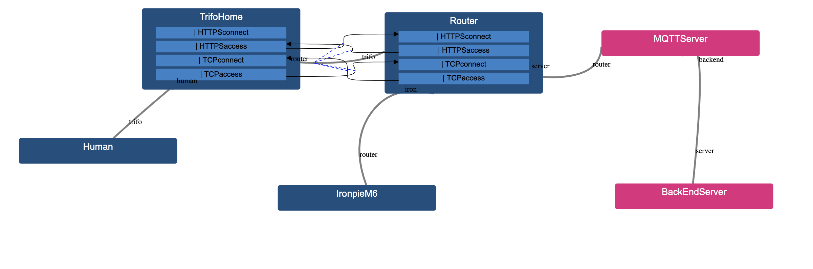
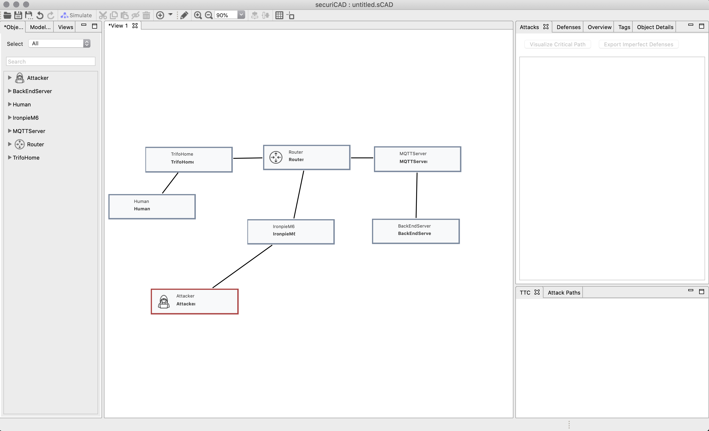

# Step-by-Step Guide

This guide aims to go through the work process with creating and implementing a model. The first part tackles how to create an DSL and the second part how to simulate an attack in securiCAD.

It is easiest to learn the syntax by modifying an already existing DSL, e.g exampleLang that can be found [here](https://github.com/mal-lang/exampleLang). When you want to create your own DSL you can use the exampleLang project as a template and follow the instructions at the bottom of the README-file.

## Creating a model

We will use a pre-existing model for this tutorial. The model is originally from a thesis by Eric Bröndum and Christoffer Torgilsman and can be found [here](http://kth.diva-portal.org/smash/record.jsf?pid=diva2%3A1450590&dswid=-7754).

The model contains of six different objects.

    1. The human user
    2. Trifo Home, an mobile application
    3. Router
    4. Ironpie m6, a robot vacuum cleaner
    5. MQTT Server
    6. Trifo BackEnd Server


You can make this as complicated and realistic as you like but lets keep it simple. Every object in this model is assumed to "one piece", therefore we will not seperate software from hardware or different running applications on hardware. Lets divide the objects into two categories "Home" and "Company". The Home-category will contain all objects that is found in the users home or what the user can interact with directly and the Company-category is what the company provides.

To get started go to path-to-project/src/main/mal and create a .mal-file named the same name as you specified in the pom.xml-file at the mal.file row.

For this guide sake we will name it main.mal. You can have several .mal-files if you want to divide the code up and import them. Here we will just stick to one file and two categories.

Start with defining the categories

```
category Home{
}

category Company{
}
```

Inside these categories we can define the assets. There are six different assets, or objects, in the model.

```
category Home{
  
  asset Human{
  }

  asset TrifoHome{
  }

  asset Router{
  } 

  asset IronpieM6{
  }
}

category Company{

  asset MQTTServer{
  }

  asset BackEndServer{
  }
}
```

Same principle as always when you code: Compile often to find errors. If you want to remove the old version and compile a new run the command in the projects main folder

```
mvn clean install
```

If we were to visualize the code right now it would look like this.


This image was generated by MAL-visualization. You can find the githubpage and how to install it [here](https://github.com/mal-lang/MAL-visualization).

Now all the assets are in place but there are no connections between these. In the model there are connections using both TCP & TCP w/ssl and HTTPS between many of the assets. Before we can model these connections we first need to assiociate the assets with eachother.

We will start with associating the human-object to TrifoHome. We assume that there could be more than one human in the household. They can also share a smartphone, therefore many different humans can connect to the same TrifoHome-app if they want. They can also connect to different apps if they own more than one smartphone.

```
associations{
  Human [human] * <- UserInteraction -> * [trifo] TrifoHome
}
```
Lets go through what just happened. Human stands for the asset Human, and TrifoHome stands for the asset TrifoHome. These two can now connect with each other calling human and trifo. * stands for that infinite many humans can connect to infinite many trifos. And we name this association to "UserInteraction". Lets say that TrifoHome has a function named "access", then we can call it from the Human asset using 
```
trifo.access
```
We add associations for all assets and put them at the bottom of our main.mal-file.

```
category Home{
  
  asset Human{
  }

  asset TrifoHome{
  }

  asset Router{
  } 

  asset IronpieM6{
  }
}

category Company{

  asset MQTTServer{
  }

  asset BackEndServer{
  }
}

associations{
  Human [human] * <-- UserInteraction --> * [trifo] TrifoHome
  TrifoHome [trifo] * <-- AppConnection --> 1 [router] Router
  IronpieM6 [iron] * <-- VacuumConnection --> 1 [router] Router 
  MQTTServer [server] * <-- ServerConnection --> 1 [router] Router
  BackEndServer [backend] 1 <-- BackEndConnection --> 1 [server] MQTTServer
}
```
You can see that here we also have a 1 in the associations. That means that we can only connect 1 of that asset to another asset. For example, the vacuum cleaner IronpieM6 can only connect to one router, but a router can connect to infintely many vacuum cleaners. In reality we wouldn't be able to connect infinitely many vacuum cleaners to the same router but we assume that the users of the model will not try to do that.

If we visualize the model again we will see:


The assets are now associated with eachother. This means that we can start calling for assets inside other assets. 

It is time to start making the connections from the model. As stated earlier, these connections can be as complicated as you like with many connections within the asset itself. For example, a guessed password-function might lead to an access-function and the access-function within the asset, which connects to another asset and so on.

Lets connect TrifoHome with the router. We will name two different functions, one for HTTPS and one for TCP. The code inside these two assets will look like this

```
  asset TrifoHome {
      | HTTPSconnect

      | HTTPSaccess
        -> router.HTTPSconnect

      | TCPconnect
      
      | TCPaccess
        -> router.TCPconnect
    }

  asset Router {
      | HTTPSconnect

      | HTTPSaccess
        -> trifo.HTTPSaccess

      | TCPconnect

      | TCPaccess
        -> trifo.TCPconnect
    }
```
The first function in TrifoHome is what happens when someone connects to it through HTTPS. The second function is what will happen when you use HTTPS to access other services. Same principle for TCP. Right now nothing happens when you connect to the Router or TrifoHome. The user can specify the internal structure of the object with adding necessary functions.



We add the same functions for IronpieM6. We also add a function for ssh login. For simplicity we imagine that connecting to the IronpieM6 gives us direct access to both the TCP connection and HTTPS connection.

We will simulate a brute force attack on the ssh. When an attacker is added, it is assumed that they already got a foothold on that function. Therefore we need to circumvent it. This can be done by dividing the attack into two steps.

First we add a function for guessing the password

```
  asset IronpieM6 {
      | HTTPSconnect

      | HTTPSaccess
        -> router.HTTPSconnect

      | TCPconnect
      
      | TCPaccess
        -> router.TCPconnect
      
      | ssh
        -> HTTPSaccess,
        TCPaccess
      
      | guessPassword

    }
```

The guessPassword function call another function that we will call passwordSuccess, but here we will add a probability distribution for success. This will act as a hurdle, since the person trying to brute force the login credentials will not succeed immediately. You can find what different distributions MAL supports [here](https://github.com/mal-lang/malcompiler/wiki/Supported-distribution-functions). There exists some pre-defined distributions, we will use "HardAndUncertain".

If you want to read more about the probability distributions and their properties you can find a list of the ones included in MAL and many more at [Wikipedia](https://en.wikipedia.org/wiki/List_of_probability_distributions) or at [Wolframalpha](https://mathworld.wolfram.com/topics/StatisticalDistributions.html). If you want more information about probability distributions in general, then you can go to the lecture notes for the course SF2940 Probability Theory. Chapter 2 is dedicated to probability distributions. You can find the notes [here](https://www.math.kth.se/matstat/gru/sf2940/lectnotemat5.pdf).

```
  asset Router {
      | HTTPSconnect

      | HTTPSaccess
        -> trifo.HTTPSaccess

      | TCPconnect

      | TCPaccess
        -> trifo.TCPconnect
      
      | UDPconnect
    }

  asset IronpieM6 {
      | HTTPSconnect

      | HTTPSaccess
        -> router.HTTPSconnect

      | TCPconnect
      
      | TCPaccess
        -> router.TCPconnect
      
      | UDPaccess
        -> router.UDPconnect

      | ssh
        -> HTTPSaccess,
        TCPaccess,
        UDPaccess
      
      | guessPassword
        -> passwordSuccess

      | passwordSuccess [HardAndUncertain]
        -> ssh
    }
```


Lastly we can add the UDP connection between the Router and IronpieM6 and we are done with all the connections for these three assets.

```
  asset IronpieM6 {
      | HTTPSconnect

      | HTTPSaccess
        -> router.HTTPSconnect

      | TCPconnect
      
      | TCPaccess
        -> router.TCPconnect

      | ssh
        -> HTTPSaccess,
        TCPaccess
      
      | guessPassword
        -> passwordSuccess

      | passwordSuccess [HardAndUncertain]
        -> ssh
    }
```
For this tutorial we won't bother with the connections between Human, MQTTServer and BackEndServer. If would like to add them you can copy-paste from the already completed assets and change the names when you call other assets functions.

Compile it and create a .jar-file for securiCAD. For more information how to get securiCAD working visit 
```
mvn clean install
mvn package -PsecuriCAD
```
Open up securiCAD and when the program asks to you chose a .jar-file go to
```
path-to-project/target
```
and chose your *.jar-file and load it up.

We can now recreate the model in securiCAD using the objects, or assets. In this tutorial we have created assets that mimics the graph in the paper. You do not necessarily need to do that, you can create a more general DSL, e.g coreLang, that will have more use cases. This DSL is very specific for the paper.

Click and drag the assets unto the canvas and connect them by holding shift and click-drag the connections between the assets. We organize the model in the same way as we organized the DSL.



We attach an attacker asset to IronpieM6. When we attach the attacker we get to chose where the attacker has gained foothold. We chose GuessPassword, since that function points to our PasswordSuccess function that simulates a dictionary bruce force attack.


The model is now ready for its first simulation. Press the simulate button in the top left corner. 

The results will show up on the right column. If we press on the asset we will see all the functions and if they are at risk. The darker color, the more risk. The reason why GuessPassword is dark is because the attacker gains 100% foothold on its first function. 


We have marked ssh in the image. In the lower right column you find Time to Compromise (TTC). This is a probability graph how likely it is for the attack to succeed. Since we used the probability distribution "HardAndUncertain" the probability of an attacker breaking the password will never be higher than 50%, no matter how long the attack persist.

We have created connections between the IronpieM6 and the router. If we click on the router we can see that it risks to be compromised as well. Click on HTTPSconnect to see the risk for success rate that an attacker will connect through HTTPS to the router through the IronpieM6.


You can produce an attack graph by pressing "Visualize Critical Path" in the "Attacks" window to the right. This generates a visual representation of the path that an attacker could take to compromise the asset.


This representation will grow in size depending how large and detailed your model is.

In this tutorial we have created a DSL with using MAL and compiling it into a .jar-file using foreseetis Maven repository. Then we built the model in securiCAD and ran an dictionary brute force attack simulation.

## More examples

We have created a simple DSL and a model to simulate attacks. Here we will extend the model.

Lets imagine that our robot vacuum cleaner has protection implemented against bruteforce attacks. We can add that type of defense with the # symbol.

## Defense

There are two syntax rules to follow for defenses. First we need to become familiar with AND. In the step-guide we did not use AND, only OR.

& (or AND) means that multiple steps need to be fullfilled in order to advance. Example

```
& step1
  -> step3
& step2
  -> step3
| step3
```

In order to reach step3 in the above example both step1 and step2 needs to be fullfilled.

To use defense we write

```
& step1
  -> step2
# defense
  -> step2
```

Here we also use a & (AND) because we need to include the defense step. If we would use | (OR) then the program would just skip the defense and go straight to step2.

If the defense is active, then the attacker cannot reach step2 even if the attacker would could reach step1. You can set a defense to either on, off or to a probability that it is active.

If it is off, then the attacker can reach step2. If you set it to a probability, then it will increase the time to compromise for the asset that you are interested in.

We change the syntax for our robot vacuum cleaner to

```
  asset IronpieM6 {
      
      | HTTPSconnect

      | HTTPSaccess
        -> router.HTTPSconnect

      | TCPconnect

      | TCPaccess
        -> router.TCPconnect
      
      | UDPaccess
        -> router.UDPconnect

      | ssh
        -> HTTPSaccess,
        TCPaccess,
        UDPaccess

      | guessPassword
        -> passwordSuccess
      
      & passwordSuccess [HardAndUncertain]
        -> ssh

      # antiBruteforce
        -> passwordSuccess
    }
}
```
If you have followed the steps so far, save the model using "Save as" anywhere except under the target-folder in your project directory. That folder will be deleted if you run the command "mvn clean".

Recompile the code, create a new .jar file and restart securiCAD.

When you click on the ironpieM6 you will see to the right that there exists a defense tab as well. Click on the tab adjust the defense.


In the first example we will turn on the defense and run the simulation. You can see on the graph for the time to compromise that the attacker could not attack the router.


Since no attack was possible we cannot generate any visualization, but we go back to the defense tab for ironpieM6 and change the defense from "On" to "Probability", with a probability of 0.5.


If we simulate an attack this time the time to compromise will decrease from step-to-step guide but there is still a chance for the attacker to reach its target.


And the visualization of the attack now looks like, where the defense step is included


## AND

Lets look a little bit closer on the & (AND) syntax. As stated before it means that two or more steps needs to be fulfilled in order to advance.

Lets imagine that the application, TrifoHome, has 2FA (two factor authentication) activated. We both need a password and a security code generated by either another application, sms, e-mail etc.

We add the following lines to the TrifoHome asset

```
  asset TrifoHome {
      
      | password
        -> access

      | authentication
        -> access      

      & access
        -> HTTPSaccess,
        TCPaccess

      | HTTPSconnect

      | HTTPSaccess
        -> router.HTTPSconnect

      | TCPconnect
      
      | TCPaccess
        -> router.TCPconnect
    }
```

## Existence

Existence does exactly what it sounds like, it checks if something exists and if it does, it advances to the next step. The syntax for Existance is E. Example

```
E exisOrNot
  <- checkExistence
  -> step
```

Since you should not do anything illegal lets assume that you visit your friends house and they have a robot vacuum cleaner. You borrow your friends phone and try to guess the password. If you write the correct password you will be prompted to fill in the authentication code, so your friend must be in the house to be able to give it to you.

We have already added the necessary AND condition in the previous topic. Now we have to add a condition if our friend is there and an attack step.

```
  asset TrifoHome {
      | attack
        -> passwordAttack,
        tokenExists
      
      | passwordAttack [HardAndUncertain]
        -> password

      E tokenExists
        <- human
        -> human.tokenGenerate
      
      | password
        -> access

      | authentication
        -> access      

      & access
        -> HTTPSaccess,
        TCPaccess

      | HTTPSconnect

      | HTTPSaccess
        -> router.HTTPSconnect

      | TCPconnect
      
      | TCPaccess
        -> router.TCPconnect
    }
```

In our human asset we need to add a step called tokenGenerate, since it is the step that we are calling for in the TrifoHome asset.

```
  asset Human {
    
      | tokenGenerate 
        -> trifo.authentication
    }
```

The step just points to the authentication, since our friend gives us the code when asked.

To simulate this we need to set an attacker on the TrifoHome asset in securiCAD instead of IronpieM6 that we have used earlier. When connecting the attacker you must chose the "Attack" function as demonstrated in the step-by-step guide.


Just as before, what we are really interested in is access to the router, not the app itself. The visualization would look like


Just as there exists an Exist-function, there also exists a not Exists-function. It works the same with the difference that it only goes to the second step if the checked asset does not exist.

## Conclusion

In this step-by-step guide we have created our own DSL with MAL, based on a model for the Ironpie m6. We started with defining the assets creating all the connections between then. Then we added attack vectors and potential vulnerabilities. You do not need to know the exact way to attack since many attacks are unknown to the victim until their occur. Therefore it is ok to create an attack named for example "Unknown attack" in which you try to forsee the consequences.

We will not go through the entirety of MAL here but this should get you started with building your own DSL. You can find full MAL syntax at [here](https://github.com/mal-lang/mal-documentation/wiki/MAL-Syntax).

The final MAL code for this guide can be found here.

Good luck!

```
category Home {
  
  asset Human {
    
      | tokenGenerate 
        -> trifo.authentication
    }

  asset TrifoHome {
      
      | attack
        -> passwordAttack,
        tokenExists

      | passwordAttack [HardAndUncertain]
        -> password
         
      E tokenExists
        <- human
        -> human.tokenGenerate

      | password
        -> access

      | authentication
        -> access      

      & access
        -> HTTPSaccess,
        TCPaccess

      | HTTPSconnect

      | HTTPSaccess
        -> router.HTTPSconnect

      | TCPconnect
      
      | TCPaccess
        -> router.TCPconnect
    }

  asset Router {

      | HTTPSconnect

      | HTTPSaccess
        -> trifo.HTTPSconnect

      | TCPconnect

      | TCPaccess
        -> trifo.TCPconnect

      | UDPconnect
    }

  asset IronpieM6 {
      
      | HTTPSconnect

      | HTTPSaccess
        -> router.HTTPSconnect

      | TCPconnect

      | TCPaccess
        -> router.TCPconnect
      
      | UDPaccess
        -> router.UDPconnect

      | ssh
        -> HTTPSaccess,
        TCPaccess,
        UDPaccess

      | guessPassword
        -> passwordSuccess
      
      & passwordSuccess [HardAndUncertain]
        -> ssh

      # antiBruteforce
        -> passwordSuccess
    }
}

category Company {
  asset MQTTServer {
    }

  asset BackEndServer {
    }
}

associations {
    Human [human] * <-- UserInteraction --> * [trifo] TrifoHome
    TrifoHome [trifo] * <-- AppConnection --> 1 [router] Router
    IronpieM6 [iron] * <-- VacuumConnection --> 1 [router] Router 
    MQTTServer [server] * <-- ServerConnection --> 1 [router] Router
    BackEndServer [backend] 1 <-- BackEndConnection --> 1 [server] MQTTServer
}
```
