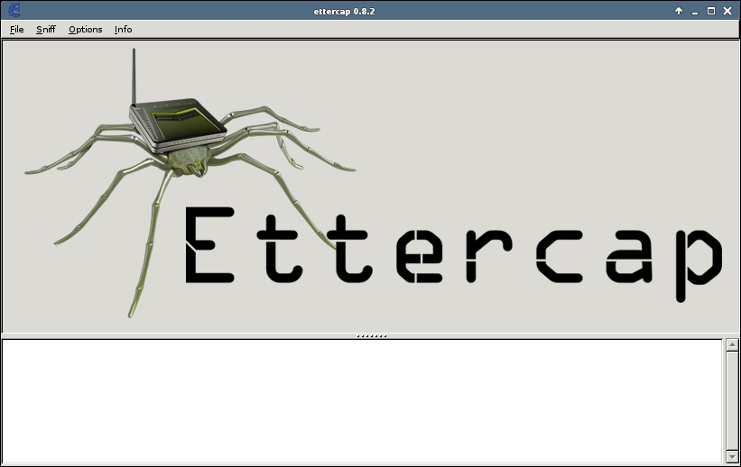
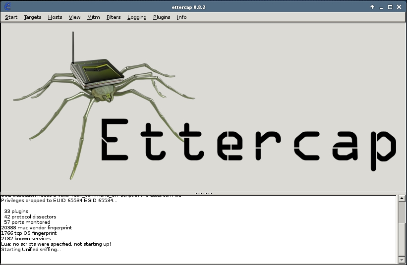
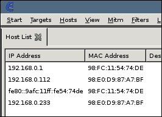
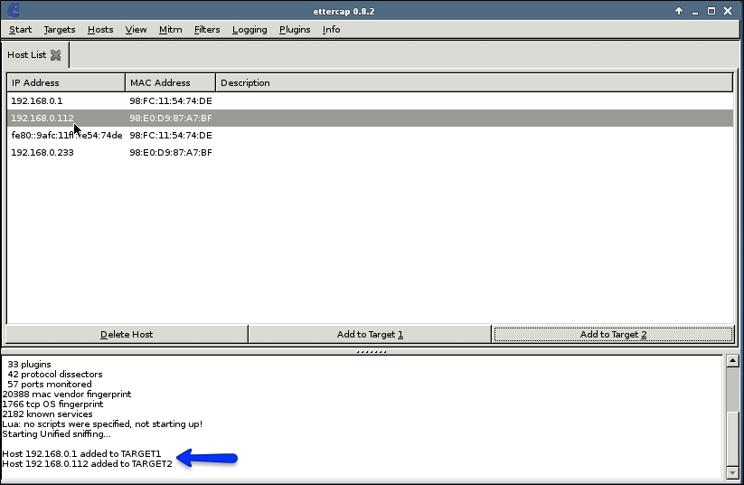

# ARP Spoofing and MitM attacks

## What is ARP?
ARP stands for Address Resolution Protocol, and is a link layer protocol used for discovering and associating link layer addresses like MAC addresses, to Internet layer addresses like IP addresses. It was first introduced in [RFC 826](https://www.rfc-editor.org/rfc/rfc826.txt) back in 1982, and is still in wide use today.

## What is ARP Spoofing?
As stated above, ARP can be used to associate MAC addresses to IP addresses. Imagine that an attacker sends out their own ARP messages. This way, they could convince a target computer in the same network that the attacker's computer is the default gateway. Simultaneously, the attacker could convince the default gateway that their computer is the target computer. This could have dire consequences since the target computer then would send all of its traffic to the attacker's computer, instead of to the actual default gateway. Meanwhile, the default gateway would think that all incoming traffic that is addressed to the target computer should go to the attacker's computer.

This is called ARP Spoofing, or ARP Poisoning, and is a common technique used to do Man in the Middle (MitM) attacks.

## MitM attack with Ettercap and Wireshark
The following example is from the book "Mastering Kali Linux Wireless Pentesting" by B. Sak and J. R. Ram, 2016. All screenshots and images in this examples are also from there. [1]

Ettercap is a tool commonly used for MitM attacks, and it comes with Kali Linux by default. This is what it looks like on startup:

We start by clicking Sniff > Unified sniffing..., or by pressing CTRL+U. You should see some text output at the bottom of the screen, including the text "Starting Unified sniffing...".

Now, some new options should have become visible at the top of the window. Click on Hosts > Host List to see all the hosts that Ettercap has identified in the network.

There aren't any ways to figure out the target and the default gateway's IP addresses through Ettercap, so you will have to do that in some other way. You could check your computer's ARP table, do some reconnaissance using nmap or fping, or use another third party application to accomplish this.

In this example, the host with IP address 192.168.0.1 is the default gateway, and the host with IP address 192.168.0.112 will be our target in this example. We'll select the first host, the one with IP 192.168.0.1, and select Add to Target 1. Next, we do the same with the second host, the one with IP 192.168.0.112, and select Add to Target 2.

Now we're going to start the ARP Spoofing. Click on Mitm > ARP poisoning..., and a dialog should pop up with two checkbox options:
- Sniff remote connections
- Only poison one-way

Make sure "Sniff remote connections" is checked and "Only poison one-way" is not. Click OK.

Now, any interesting traffic between the host and the default gateway is going to be outputted in the text section at the bottom of the window.

## References
[1] B. Sak and J. R. Ram, Mastering Kali Linux wireless pentesting : test your wireless network's security and master advanced wireless penetration techniques using Kali Linux, 1st edition. 2016.