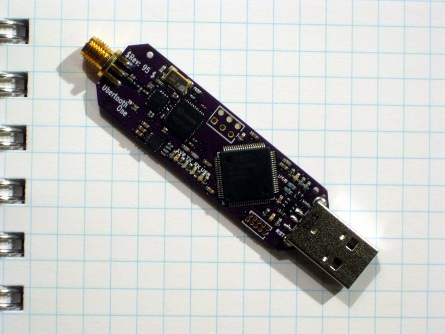

# Bluetooth

## Primer
[Here](https://www.youtube.com/watch?v=eZGixQzBo7Y&list=PLYj4Cw17Aw7ypuXt7mDFWAyy6P661TD48) is a pretty good primer on the fundamentals of Bluetooth.

Bluetooth comes in two flavors, Bluetooth Classic and [Bluetooth Low Energy (BLE)](/docs/pages/guides/radio/ble.html).

[Here](https://www.youtube.com/channel/UCLcFjjeNcUorRySbA8YTV0g/playlists) is a pretty good video introduction to BLE.

## Bluetooth MITM
Bluetooth can be intercepted with a couple of Bluetooth USB dongles and software such as [GATTacker](https://github.com/securing/gattacker) or [BtleJuice](https://github.com/DigitalSecurity/btlejuice), as detailed in [Melamed, An active man-in-the-middle attack on bluetooth smart devices, 2018](https://www.researchgate.net/publication/322999675_An_active_man-in-the-middle_attack_on_bluetooth_smart_devices) and [Melamed, Hack-a-ble: Hacking BLE Smart Devices, 2017](https://youtu.be/5xJ_xeNJ3WU).
We can also use the [Ubertooth One](/docs/pages/guides/Wireless/bluetooth.html#ubertooth) to intercept Bluetooth signals from your target.

## SweynTooth
Some interesting new vulnerabilities were discovered in February 2020. More information [here](https://asset-group.github.io/disclosures/sweyntooth/).

## Ubertooth
[The Ubertooth Project](http://ubertooth.sourceforge.net/) is an open-source platform used to experiment with Bluetooth. It can be used to capture and demodulate Bluetooth packets, and can be combined with packet analyzer tools such as [Kismet](https://www.kismetwireless.net/) or [Wireshark](https://www.wireshark.org/).

The latest version is the Ubertooth One. The lab has two such devices that you can either try out at the lab or borrow for a project.
The Ubertooth One is mainly used to sniff BLE, but can in some cases also be used with Bluetooth Classic.

[1]

You can find the GitHub repository for the Ubertooth [here](https://github.com/greatscottgadgets/ubertooth).

## References
[1] Ubertooth One. *Great Scott Gadgets*. [https://greatscottgadgets.com/ubertoothone/](https://greatscottgadgets.com/ubertoothone/). (Fetched 2021-06-03) 