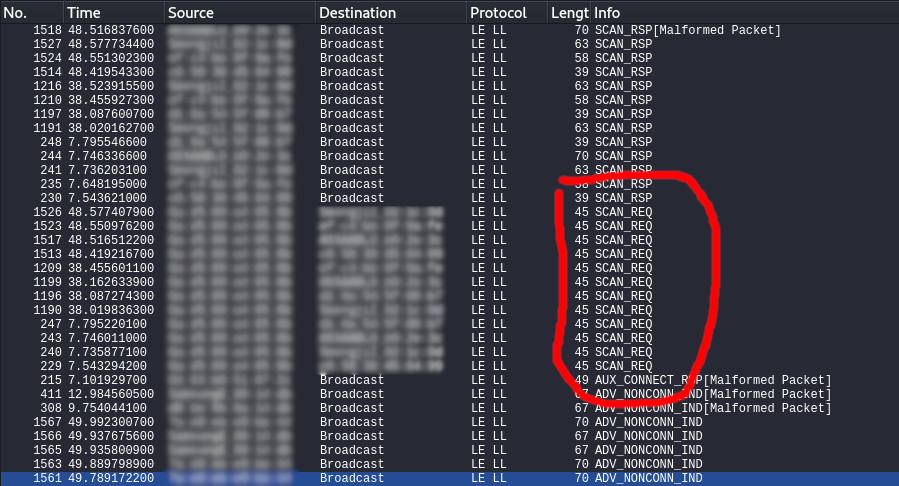

# Ubertooth One

The Ubertooth One is an open source development platform used to experiment with Bluetooth, and [BLE](/pages/guides/radio/ble.html) in particular.

You can find the GitHub repository for the Ubertooth [here](https://github.com/greatscottgadgets/ubertooth). The repo also contains a [wiki](https://github.com/greatscottgadgets/ubertooth/wiki), which among other things holds the [Build Guide](https://github.com/greatscottgadgets/ubertooth/wiki/Build-Guide), the [FAQ](https://github.com/greatscottgadgets/ubertooth/wiki/FAQ), and a [guide on how to use the Ubertooth One together with Wireshark](https://github.com/greatscottgadgets/ubertooth/wiki/Capturing-BLE-in-Wireshark).

## Installation and Setup
The Ubertooth One works with several operating systems, but this guide will assume that you are using <b>Kali Linux</b>. For guides on other operating systems, please see the Build Guide in the [Ubertooth repository](https://github.com/greatscottgadgets/ubertooth/wiki/Build-Guide).

First of all, you need to install the prerequisites:
```
sudo apt install cmake libusb-1.0-0-dev make gcc g++ libbluetooth-dev wget \
pkg-config python3-numpy python3-qtpy python3-distutils python3-setuptools
```

Now you need the Bluetooth baseband library (libbtbb):
```
wget https://github.com/greatscottgadgets/libbtbb/archive/2020-12-R1.tar.gz -O libbtbb-2020-12-R1.tar.gz
tar -xf libbtbb-2020-12-R1.tar.gz
cd libbtbb-2020-12-R1
mkdir build
cd build
cmake ..
make
sudo make install
sudo ldconfig
```

And last but not least you need the Ubertooth repo itself in order to sniff Bluetooth packets and configure the Ubertooth:
```
wget https://github.com/greatscottgadgets/ubertooth/releases/download/2020-12-R1/ubertooth-2020-12-R1.tar.xz
tar -xf ubertooth-2020-12-R1.tar.xz
cd ubertooth-2020-12-R1/host
mkdir build
cd build
cmake ..
make
sudo make install
sudo ldconfig
```

If you for some reason have an older version of Wireshark (older than v.2.2), you need to get some additional Wireshark plugins. Please see [this page](https://github.com/greatscottgadgets/ubertooth/wiki/Build-Guide#wireshark-plugins) to learn how.

## Sniffing Bluetooth packets in Wireshark
The Ubertooth One can be used with Wireshark to sniff BLE packets. To sniff BLE packets in Wireshark, follow these steps:
1. Open up a terminal and run `mkfifo /tmp/pipe`
2. Open up Wireshark
3. Navigate to Capture > Options and then click Manage Interfaces
4. Next click Pipes, and click the `+` button
5. Name the new pipe "/tmp/pipe"
6. Save and exit the Capture Options
7. Start a Wireshark Capture with the "/tmp/pipe" interface/pipe selected
8. In a Terminal, run `ubertooth-btle -f -c /tmp/pipe`
9. Go back to Wireshark - you should now see the packets coming in


## First Steps
There are two things that you can try out once you've gotten the Ubertooth set up properly.

### Spectrum Analysis
The first thing you can try is to run a simple spectrum analysis.
1. Make sure that the Ubertooth has an antenna connected to it - *never operate the Ubertooth without an antenna connected*
2. Plug the Ubertooth into your computer
3. Navigate to the `host/python/specan_ui` directory in the Ubertooth repo
4. Execute `ubertooth-specan-ui` and enjoy the show!

### LAP Sniffing
A complete Bluetooth MAC address (BD_ADDR) consists of 48 bits. LAP stands for Lower Address Part and consists of the 24 lower bits of the BD_ADDR, and is the only part of the address that is transmitted in every Bluetooth packet.

The method in this example shows false positives at times. Therefore, check if the same LAP is used in multiple packets to make sure it's correct.

1. Make sure that the Ubertooth has an antenna connected to it - *never operate the Ubertooth without an antenna connected*
2. Plug the Ubertooth into your computer
3. Execute `ubertooth-rx` and enjoy the show! Try sending some test traffic, for example by using a smartphone and a Bluetooth peripheral.

If you want to find the Upper Address Part (UAP) of the BD_ADDR once you've gotten a LAP that you're confident is correct, run `ubertooth-rx -l [LAP]`

## BLE Sniffing - An example with the Glue Smart Lock
*Please note: This example was written by someone very new to this topic. There are possibly and probably easier methods to accomplish the same thing. If you have suggestions on how to improve this section, please [contact us here](/pages/feedback.html).*

In this simple example I will be sniffing the traffic of a smart lock, using the following tools:
- A Ubertooth One with antenna
- A Kali Linux computer with the necessary firmware installed for the Ubertooth
- A Glue Smart Lock or similar BLE peripheral
- A smartphone with the Glue Smart Lock app (or equivalent)

The computer used in this example is a desktop computer available at the lab. The lab also has a Ubertooth and a Glue Smart Lock you can borrow - you can check the availability of the Ubertooth [here](/pages/lab-equipment/hacking-tools.html) and of the smart lock [here](/pages/lab-equipment/iot-devices.html). If needed, there are also smartphones at the lab you can use. However, you might need to make sure to download the correct apps and configure the smartphone for the BLE peripheral you are using.

I began by following the steps of the ["Sniffing Bluetooth packets in Wireshark"](/pages/guides/Wireless/ubertooth.html#sniffing-bluetooth-packets-in-wireshark) section above. Make sure you can see some traffic showing up in Wireshark before continuing.

Since this example was conducted in the lab which contains multiple BLE devices, it was quite noisy traffic-wise. The challenge was therefore to identify the smart lock in Wireshark, so I could see the relevant packets being sent. I used my knowledge of BLE to do this. The problem in the lab is that there are many peripherals - and each peripheral sends out advertisement messages at a rate of about one per second. That's a lot of data to sort through, unless you're lucky and Wireshark is able to show you the name of the target peripheral straight up. For me, that was not the case.

However, there are usually a limited number of central devices, and they don't transmit nearly as much data. It was therefore a lot easier to find the central device first and go from there, rather than sift through all of the peripheral ADV_IND packets.

I knew that only the central device sends out SCAN_REQ messages. I therefore began by sorting the traffic by the INFO column, scrolled to where all the SCAN_REQ messages are, and then found the addresses of the central devices around. Below is what this looked like in Wireshark:



In my case, there seemed to be two central devices nearby. I didn't know what the other one was, but one must for certain have been my smartphone. I did not yet know which of the two devices was my phone, but I was able to figure it out by trying to scan for Bluetooth devices on my phone - that generated some requests. If all else had failed: two devices are not very many and I could just check both.

Next, I looked through the peripheral devices that the phone sent those SCAN_REQ messages to. There were a few, but I was able to rule some of them out by copying the addresses* and using the following display filter in Wireshark:

```bluetooth.addr == aa:bb:cc:dd:ee:ff```

where aa:bb:cc:dd:ee:ff is the address copied. One thing I noticed here is that the view in Wireshark didn't update when using a display filter, even though new packets were coming through. The view only updated once I clicked "enter" in the filter field. This was a problem, since I wanted to be able to see in real time when I scanned for devices or sent "lock" and "unlock" commands to the Glue Lock. The solution was the command below, which sets a target device for the Ubertooth. This limits the captured packets, much like pure capture filters in Wireshark.

```ubertooth-btle -t aa:bb:cc:dd:ee:ff```

You can clear the target by passing ```none``` as an argument, like so:

```ubertooth-btle -t none```

After this, I could start the Wireshark capture again while only seeing the traffic from the target device - the one I suspected to be the Glue Lock. To confirm I had the correct address, I simply observed the ADV_IND packets coming through, and then turned off the Glue Lock by taking out the batteries. The ADV_IND packets stopped coming in, and after repeating this process a few more times just to be entirely sure, I was able to confirm that I had found the right device.

\*Click the row in Wireshark, look at the frame and locate the address you want to copy. Right click on the address and select Copy > Value.
## Credit
All of the information on this page is taken from the [Project Ubertooth Github page](https://github.com/greatscottgadgets/ubertooth/wiki/Getting-Started). For more details on any topic on this page, consult the [Project Ubertooth Github page](https://github.com/greatscottgadgets/ubertooth/wiki/Getting-Started) first.
