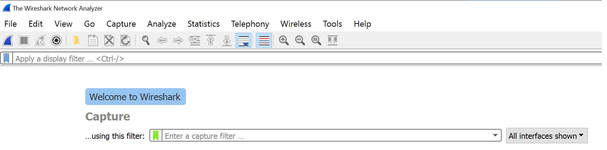

# Wireshark

[Wireshark](https://www.wireshark.org/) is a popular packet sniffer tool that can be used to listen in on network traffic.

## Getting started with Wireshark
Here, we will be assuming that you've already downloaded and installed Wireshark onto your computer. You can download Wireshark [here](https://www.wireshark.org/download.html) and follow the installation instructions there if you haven't already.

When you open Wireshark, you should see something that looks like this:

Underneath the filter input, you'll see a list of all the networks that your computer is currently connected to and that you can listen in on. You should also see graphs next to each network - these represent the amount of traffic currently in them. If you click on any of the list items, you'll be directly redirected to the capturing page, and a new capture will start automatically. You should see new packages dropping in - these can be of all sorts of protocol types.

By default, Wireshark has something called "promiscuous mode" activated. This means that it not only captures traffic to and from your computer, but all the traffic on the network. You can check if you have promiscuous mode turned on by clicking Capture > Options and check the checkbox at the bottom of the screen.

You can stop capturing packets at any time by clicking the red square button labeled "Stop capturing packets" in the top left corner of the screen.

## Wireshark Filters
Before we get too deep into Wireshark filters, you should know that there are two kinds of filters in Wireshark: Capture Filters, and Display Filters.

Capture Filters are set *before* you start a new capture. They limit the capture to only catch packets that match the capture filter - it makes the whole capture smaller, since it isn't capturing all of the traffic. You cannot change the Capture Filter mid-capture.

Display Filters are set *after* you start a new capture. Wireshark will still capture all of the traffic, but only packets that match the display filter are shown in the list. Display Filters can also be changed mid-capture, since they only change what is displayed on screen - not the capture itself.

You can combine Capture Filters and Display Filters as you please. For example, you could set a Capture Filter to capture all the TCP packets, and then view only the ones to or from a specific IP address using Display Filters.

There are a bunch of filters you can apply to your captures to make it easier to find what you're looking for. If you start typing in the filter input field, you'll see suggestions on what kind of filters you can use.

If you want to filter by protocol, most likely it will consist of you just typing the protocol name in lower case: tcp, dns, and so on. You can use the [Wireshark Protocol Reference](https://wiki.wireshark.org/ProtocolReference) for a complete list of all the protocols you can filter by. You might also find [this list of ICS protocol filters](./wifi-mitm.html#analyzing-ics-packets-with-wireshark) useful.

Other options that are available include filtering by IP address, Ethernet address, ports, source, destination, and much more. Check out [Wireshark's documentation](https://wiki.wireshark.org/DisplayFilters) for examples and more information.

Wireshark can be used with Ettercap to perform Man in the Middle attacks. You can read more [here]().