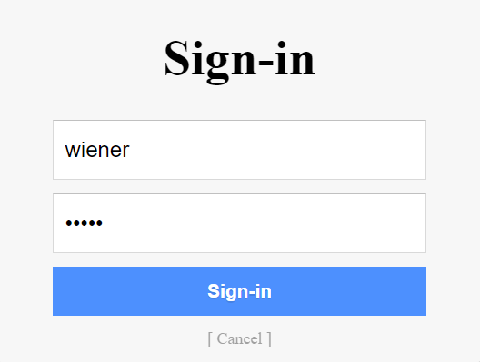

# Broken Authentication

When a system implements its authentication poorly, it's often vulnerable to attacks in this category. For example, the system can use default user names (such as "admin"), or allow weak common passwords (such as "Password1"). Other examples include Brute Force Attacks, Dictionary Attacks, Credential Stuffing, and Session Hijacking.[1]

## Weak User Credentials
If a website allows its users to use passwords that are very common or easily guessable, its very easy for an attacker to get into the website using those credentials.

### RockYou
In 2009, a company name RockYou was hacked. The attacker got their hands on over 32 million user credentials - all in plain text. The attacker then compiled a database of all the passwords, and made this list publically available. This list (named rockyou.txt) is now famous in the InfoSec community since it gives a very valuable insight in how people tend to choose their passwords. Kali Linux comes with this text file by default (found at /usr/share/wordlists/rockyou.txt.gz).[2, 3]

The text file is also available to download [here](https://github.com/brannondorsey/naive-hashcat/releases/download/data/rockyou.txt).

## Brute Force Attacks and Dictionary Attacks
When an attacker systematically tries every possible character combination to guess passwords, this is known as a Brute Force Attack. The downside with this is that depending on the length and complexity of the passwords, it could take years to find the right one.

A variation of the Brute Force Attack is the Dictionary Attack, where instead of trying arbitrary combinations of characters, the attacker uses dictionaries. This is helpful since most passwords are words (or at least include them) and not just random characters stringed together. Dictionary Attacks also tend to be faster than normal Brute Force Attacks.

Brute Force Attacks are easy for the target system to detect since they generate a significant amount of traffic. However, the attacker can modify their requests to the target so that it gets very hard to block. Using proxy servers for example, the target cannot stop the attack by blocking a specific IP address. The attacker could also vary the targeted user account, which prevents the target system from blocking login attempts to a specific user.[4]

## Credential Stuffing
When user credentials get breached through hacks, they can spread online. Using breached credentials and testing them on many different websites, like social media platforms or online marketplaces, is called Credential Stuffing. This type of attack is often automated, and usually around 0.1-0.2% of login attempts are successful. The attacker could then steal all valuable information in those accounts and then use them in other attacks, like phishing attacks or sending out spam.[5]

## Session Hijacking
Since HTTP is stateless, many websites use Cookies as identification tokens. Session Hijacking, or Cookie Hijacking, is when an attacker manages to steal a Cookie and thereby gains unauthorized access to the website.[6]

Cookie Stealing can be done using many different methods. One of them is Network Eavesdropping, where an attacker intercepts and reads traffic on a network. This can for example be used if the web application sends the Cookie unencrypted over HTTP.[7]

A technique for performing Session Hijacking after successfully stealing a Cookie is called Pass the Cookie, and is described [here](https://embracethered.com/blog/posts/passthecookie/).

## OAuth 2.0 Authentication Vulnerabilities

### What is OAuth 2.0?
OAuth 2.0 is a very popular authentication framework that allows developers to let users authenticate themselves using social media such as Facebook or Google. Because of its popularity, it is very likely that you've come into contact with apps or sites that use OAuth 2.0 in your online life. While useful, OAuth 2.0 has some vulnerabilities that can be exploited.

One such vulnerability is presented in the [PortSwigger Academy](https://portswigger.net/web-security) lab "Authentication bypass via OAuth implicit flow", which we solve below.

### Example
As stated above, the following example is from [PortSwigger](https://portswigger.net/). It's a lab called "Authentication bypass via OAuth implicit flow", and is accompanied by a website that has a login page that looks like the following:

We are given a username-password pair that represents "our" login information, which is:

Username: wiener Password: peter

The website also lets users authenticate using their email address.

The goal of the lab is to login to the account with email address carlos@carlos-montoya.net. Obviously, we are not given the password.

To solve this lab, we are going to be using PortSwigger's free software [Burp Community Suite](https://portswigger.net/burp/communitydownload) - in particular its Proxy and Repeater features. To learn more about the basics of Burp Suite, you can watch [this video by John Hammond](https://youtu.be/G3hpAeoZ4ek?t=64).

We'll start by opening up Burp Community Suite. We'll be using their preconfigured browser, but as stated in [this other example](./xxe.html#example) you can configure your own browser instead and get the same result.

Navigate to the Proxy tab in Burp Community Suite. Make sure to toggle to Intercept is off.

Open up the lab in Burp's browser (or your own configured browser). Click on "My Account" and log in using the credentials that we got in the lab description (*wiener*, *peter*).

Click on "Continue" when prompted.

We are now logged in on the website. Let's check back in on Burp Suite. Under Proxy, navigate to the HTTP History tab. Here we can see all the HTTP request that have been sent so far.

If we look through these requests, we can find the one that we used to log in. The login process starts with an HTTP GET request that starts with "GET /auth?client_id=..."

If you look at the HTTP messages following that first request, you eventually end up at a POST request that is the thing that is actually responsible for providing the credentials to the website.

Right-click on the request text and click "Send to Repeater". Navigate to the Repeater tab (it should have lit up in orange once you clicked "Send to Repeater").

Let's change the email address to the one belonging to the account we've been tasked to login to.

Click on the "Send" button. Note the response code: [302 Found](https://en.wikipedia.org/wiki/HTTP_302).

Now, right-click again on the request text and click "Request in browser" > "In original session"

You should get a popup with a URL that you can copy and paste into your browser. When you do, the request will be sent to the website and voilá: you're logged in as carlos@carlos-montoya.net.

## References
[1] A2:2017-Broken Authentication. *OWASP*. [https://owasp.org/www-project-top-ten/2017/A2_2017-Broken_Authentication](https://owasp.org/www-project-top-ten/2017/A2_2017-Broken_Authentication). (Fetched 2021-03-28) 
[2] RockYou. *Wikipedia*. [https://en.wikipedia.org/wiki/RockYou](https://en.wikipedia.org/wiki/RockYou). (Fetched 2021-03-28) 
[3] William J. Burns. Common Password List ( rockyou.txt ). *Kaggle*. [https://www.kaggle.com/wjburns/common-password-list-rockyoutxt](https://www.kaggle.com/wjburns/common-password-list-rockyoutxt). (Fetched 2021-03-28) 
[4] Blocking Brute Force Attacks. *OWASP*. [https://owasp.org/www-community/controls/Blocking_Brute_Force_Attacks#](https://owasp.org/www-community/controls/Blocking_Brute_Force_Attacks#). (Fetched 2021-03-28) 
[5] Credential Stuffing. *OWASP*. [https://owasp.org/www-community/attacks/Credential_stuffing](https://owasp.org/www-community/attacks/Credential_stuffing). (Fetched 2021-03-28) 
[6] Session Hikjacking. *Wikipedia*. [https://en.wikipedia.org/wiki/Session_hijacking](https://en.wikipedia.org/wiki/Session_hijacking). (Fetched 2021-03-28) 
[7] HTTP Cookie. "Cookie theft and session hijacking". *Wikipedia*. [https://en.wikipedia.org/wiki/HTTP_cookie#Cookie_theft_and_session_hijacking](https://en.wikipedia.org/wiki/HTTP_cookie#Cookie_theft_and_session_hijacking). (Fetched 2021-03-28) 
[8] OAuth 2.0 authentication vulnerabilities. *PortSwigger*. [https://portswigger.net/web-security/oauth](https://portswigger.net/web-security/oauth). (Fetched 2021-04-25) 