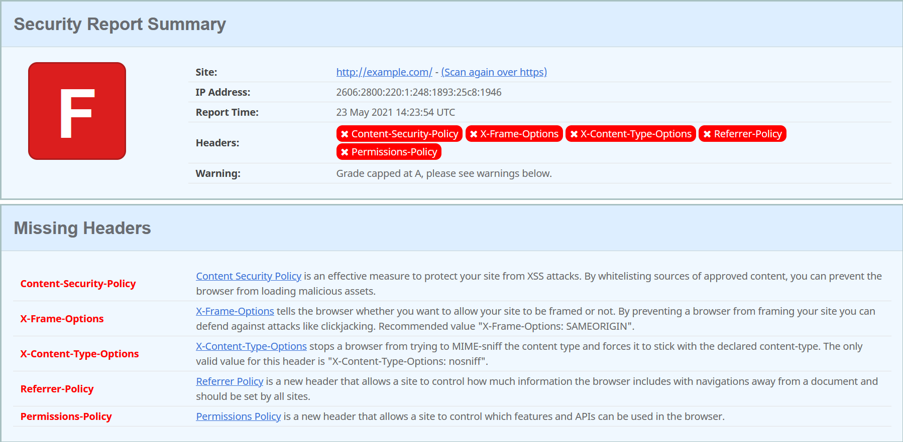

# Using Components with Known Vulnerabilities
If the target application uses components with known vulnerabilities, it is very easy for an attacker to exploit this. It takes much less energy to look for vulnerable components (like libraries and frameworks) than to start digging through the application to find an exploit of one's own.

There are multiple tools to scan an application for common flaws, and many of them can be classified as using components with known vulnerabilities. These tools can for example check for different types of security related headers. One such tool is [securityheaders.com](https://securityheaders.com/), which checks the given website for what security related headers it uses.



## Nikto
Another tool is [Nikto](https://tools.kali.org/information-gathering/nikto), which is an open source web server scanner that comes with Kali Linux.[1]

<b>*Please note*</b> that Nikto is not designed to be stealthy. If used, it is very likely that your scan will be visible in the target's logs.[2]

If you don't have Kali Linux, you can also install Nikto by cloning its [GitHub repository](https://github.com/sullo/nikto) like so:

```git clone https://github.com/sullo/nikto```

Next, go into the nikto/program directory using cd:

```cd nikto/program```

Now you can either run Nikto like:

```./nikto.pl -h http://www.example.com```<br>
or<br>
```perl nikto.pl -h http://www.example.com```

### Some of Nikto's options
The most important option is the `-h`, or `-host` flag. It specifies the host to run the scan on. This option is the bare-minimum for Nikto usage.<br>
Example:<br>
```./nikto.pl -h http://www.example.com```

Another important option is the `-p`, or `-port` flag. It specifies the port number to run the scan on.<br>
Example:<br>
```./nikto.pl -h http://www.example.com -p 80```

Lastly, you can save the output of the Nikto scan to a file by providing the `-o`, or `-output` flag, combined with the `-F` flag for the filetype. `-o` specifies the name of the file you want to write the output to, and `-F` specifies the file type of that file.<br>
Example:<br>
```./nikto.pl -h http://www.example.com -o nikto_output -F txt```

### Learn more about Nikto
Check out [Nikto's GitHub repository](https://github.com/sullo/nikto) for documentation and a full list of all the options.

Check out [Rangeforce](https://materials.rangeforce.com/tutorial/2019/12/05/Nikto/) for some more useful examples.

Check out [Nikto's website](https://www.cirt.net/Nikto2).

## References
[1] Borso, Serge. (2019). The Penetration Tester's Guide to Web Applications (Artech House information security and privacy series). Norwood: Artech House.<br>
[2] Sullo, Chris, and Lodge, David. (2014-02-18). Nikto. *Kali Tools*. [https://tools.kali.org/information-gathering/nikto](https://tools.kali.org/information-gathering/nikto). (Fetched 2021-05-23)<br>