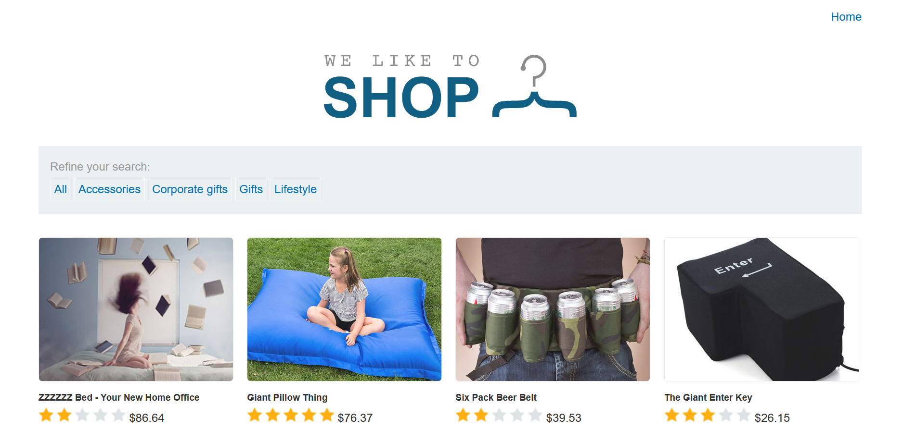
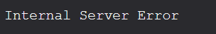

# Injection Attacks
When a system allows untrusted data to be entered into interpreters we say that the system is vulnerable to injection attacks. Examples include SQL, NoSQL, OS, and LDAP injection.[1]

## SQL Injection (SQLi)
SQL stands for Structured Query Language, and is a language used for storing, manipulating, and retrieving data in relational databases.[2, 3] When a website doesn't sanitize its incoming data, and that data is used to query a table in a database, a hacker could be able to access and manipulate data in that database using clever inputs. If the data is fetched through a login page, and the data within is storing users and their passwords, the consequences could be dire.

### Examples

#### <b>SQL injection vulnerability in WHERE clause allowing retrieval of hidden data</b>
The following is a basic example from the [PortSwigger Web Security Academy](https://portswigger.net/web-security), specifically from the lab "SQL injection vulnerability in WHERE clause allowing retrieval of hidden data".

The lab is a website that looks like this:


The shopping site displays 12 products and four categories that you can click on to filter through the displayed products. There is also a button to see all products. There are also some products that are hidden from the user, but still exist in the database. Those products are unreleased.

In this lab, the goal is to find a way to exploit an SQLi vulnerability in the product category filter so that all products are listed, no matter their status as released or unreleased products.

We are given the SQL query that is used in the backend:<br>
``` SELECT * FROM products WHERE category = 'Gifts' AND released = 1 ```

The asterisk * is a wild card that means "all". So, the query means that we want everything from the ```products``` table, where the category is 'Gifts' and the value of ```released``` is one.

We can perform the SQL injection simply by editing the URL of the links to filter through the product categories. If you click on the link to see all products in the Gifts category for example, you get redirected to the following URL:<br>
``` https://<LAB_ID>.web-security-academy.net/filter?category=Gifts ```

Let's say we didn't know the website was vulnerable to SQL injections. How would we test that it was? Well, in SQL there are multiple syntactic features that we can use to check that. One of them is the single quote: '. Let's try it out! We change our URL to the following instead:<br>
``` https://<LAB_ID>.web-security-academy.net/filter?category=' ```

Something happens:<br><br>


Why? Because the resulting query was this one:

``` SELECT * FROM products WHERE category = ''' AND released = 1 ```

When SQL looks at this query, it thinks that it should grab all products where the category is '' - that is, the empty string: nothing. Next, a new string starts with the last of the three single quotes, and presumably that string doesn't end until the next single quote ' pops up in the backend code. The result is that SQL doesn't know what to do with these weird patches of unintelligible statements, and thus, we get "Internal Server Error".

Great! Now we know that the site probably has an SQLi vulnerability. So how do we grab all those products then?

Two useful SQL features that we are going to use to construct the SQLi query are OR statements and SQL comments.
SQL comments are written like this: ```--Example comment```

Just like with comments in other languages, SQL comments tell the computer that the text within it are not to be interpreted as code.

We can use OR in combination with a boolean statement that is always true, such as 1=1, to reconstruct the WHERE part of the SELECT statement from before so that it's always true.

For example, consider the following SQL query:

``` SELECT * FROM products WHERE category = 'Gifts' OR 1=1 ```

This means that SQL should get all products where the category is Gifts, OR where 1=1. Logically, that is true for all rows in the products table, since 1=1 is always true. So SQL gets all rows in the products table, and tada - we're done!

Before we celebrate however, we need to figure out how to actually make the backend SQL end up with a query such as that one. It doesn't work to just type in "OR 1=1" in the end of your URL since that will result in a string, such as in the following query:

``` SELECT * FROM products WHERE category = 'Gifts OR 1=1' AND released = 1 ```

We need to be a bit more clever with how we construct the query. First of all, we need to end the string before OR so that it's interpreted as part of the query rather than just a string:

``` https://<LAB_ID>.web-security-academy.net/filter?category=Gifts'OR 1=1 ```

Now we have the following query:

``` SELECT * FROM products WHERE category = 'Gifts' OR 1=1' AND released = 1 ```

There is still a problem though:


Can you see why?

We still have a lingering single quote after 1=1, which starts a new string that goes on all the way down until another single quote appears. We get the same issue as when we just entered the single quote when we checked if the site was vulnerable to SQL injections.

How do we solve this? With SQL comments!

If all the rest of the query is a comment, SQL will not interpret all that ugly broken code, and we'll get rid of the "Internal Server Error".

Let's enter the following into the URL:

``` https://<LAB_ID>.web-security-academy.net/filter?category=Gifts'OR 1=1-- ```

This gives rise to this SQL query:

``` SELECT * FROM products WHERE category = 'Gifts'OR 1=1--' AND released = 1 ```

The ```AND released = 1``` part now gets interpreted as a comment, and will not be included in the query. The result is that we tell SQL to select all from products where the category is Gifts, OR where 1=1 - i.e. all products, no matter the value of the ```released``` variable.

Great! That concludes this first, very basic example of SQLi.

There are more helpful examples at [W3Schools](https://www.w3schools.com/sql/sql_injection.asp) and [PortSwigger Web Security Academy](https://portswigger.net/web-security/).

## NoSQL Injection
NoSQL is a term that refers to all databases that (surprise) aren't SQL databases.[4] Since SQL is for relational databases, another name for NoSQL databases is non-relational databases. Examples of NoSQL databases include MongoDB, Firebase, CouchDB and Redis.[4, 9] Even though SQL injection attacks don't work on NoSQL databases, that doesn't mean that NoSQL is invulnerable to injection attacks.

You can read more at [Infosec Institute](https://resources.infosecinstitute.com/topic/what-is-nosql-injection/).

## OS Injection
OS Injection, also known as Command Injection or Shell Injection, is one of the more dangerous forms of injection attacks since a successful attack can compromise the entire application and its data.[6] If the attack is successful, a hacker is able to enter arbitrary shell commands. This often gives the same privileges to the hacker as the application has on its host infrastructure, and therefore not only can the app and its data be compromised, but other parts of the server hosting the app as well.

You can read more at [PortSwigger](https://portswigger.net/web-security/os-command-injection), the creator of Burp Suite.

## LDAP Injection
LDAP stands for Lightweight Directory Access Protocol, and is an application layer protocol used for accessing and maintaining distributed directory services over IP.[7]

A directory service is a software application that allows many users to work with the same resource directories.
LDAP uses the fact that directories can be seen as databases, where the information structure is a tree. One of the most common uses of LDAP is to search a directory tree for a specific resource, and it does this through special LDAP filters (defined in [RFC 4515](https://datatracker.ietf.org/doc/html/rfc4515)). Through manipulating these filters and combining them with their own code injections, an attacker could be able to achieve their own objectives.[8]

You can read a more thorough analysis of LDAP injection in [LDAP injection techniques](https://www.researchgate.net/publication/224366575_LDAP_injection_techniques).

## References
[1] Top 10 Web Application Security Risks. *OWASP*. 2017. [https://owasp.org/www-project-top-ten/](https://owasp.org/www-project-top-ten/). (Fetched 2021-03-24)<br>
[2] SQL Tutorial. *W3Schools*. [https://www.w3schools.com/sql/](https://www.w3schools.com/sql/). (Fetched 2021-03-24)<br>
[3] SQL. *Wikipedia*. [https://en.wikipedia.org/wiki/SQL](https://en.wikipedia.org/wiki/SQL). (Fetched 2021-03-24)<br>
[4] NoSQL Database - What is NoSQL? *Microsoft Azure*. [https://azure.microsoft.com/en-us/overview/nosql-database/](https://azure.microsoft.com/en-us/overview/nosql-database/). (Fetched 2021-03-28)<br>
[5] NoSQL. *Wikipedia*. [https://en.wikipedia.org/wiki/NoSQL](https://en.wikipedia.org/wiki/NoSQL). (Fetched 2021-03-28)<br>
[6] OS command injection. *Portswigger*. [https://portswigger.net/web-security/os-command-injection](https://portswigger.net/web-security/os-command-injection). (Fetched 2021-03-28)<br>
[7] Lightweight Directory Access Protocol. *Wikipedia*. [https://en.wikipedia.org/wiki/Lightweight_Directory_Access_Protocol](https://en.wikipedia.org/wiki/Lightweight_Directory_Access_Protocol). (Fetched 2021-03-28)<br>
[8] J. M. Alonso, R. Bordon, M. Beltran and A. Guzman, "LDAP injection techniques," 2008 11th IEEE Singapore International Conference on Communication Systems, Guangzhou, China, 2008, pp. 980-986, doi: 10.1109/ICCS.2008.4737330.<br>
[9] Cloud Firestore. *Google Firebase*. [https://firebase.google.com/docs/firestore/](https://firebase.google.com/docs/firestore/). (Fetched 2021-04-25)