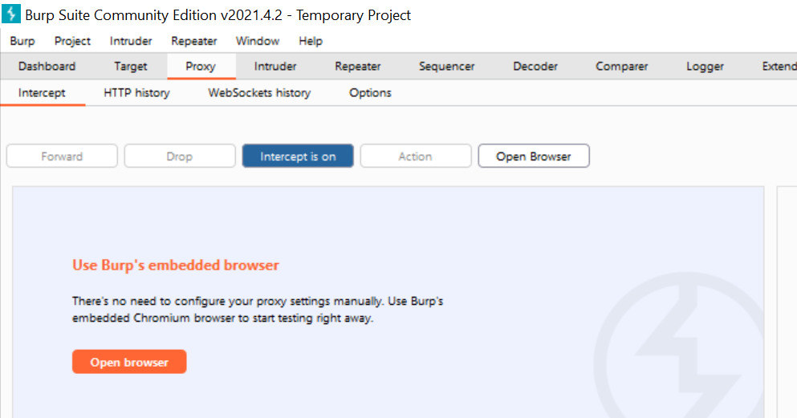
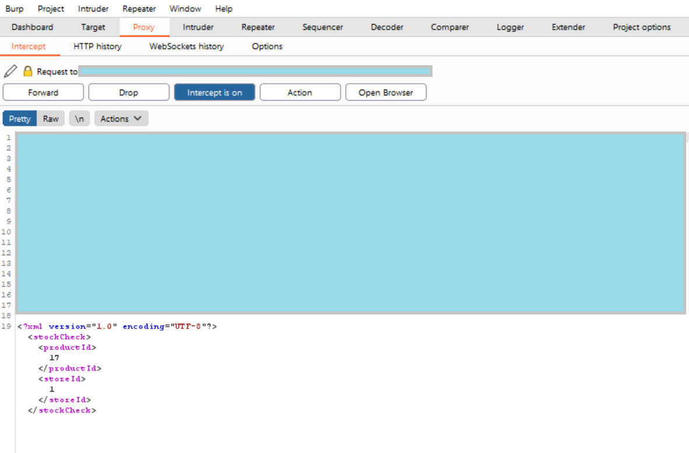
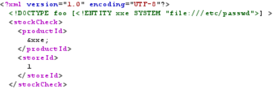

# XML External Entities (XXE)
XXE is an attack used against applications that parse XML. If the XML parser is old or carelessly configured, it could read and interpret the incoming XML input as is, and thus the attacker could view files and interact with the host system in the same way the application could.[1, 2]

XML looks similar to HTML, with a key difference: all tags are user defined. Furthermore, an XML entity is like a variable: it's a thing that holds some value. XML entities are used to represent data, without using the data itself. The information on what types of data an XML document can hold, as well as some additional information, is specified in the Document Type Definition: the DTD. If you've ever written any HTML code, you might be familiar with the DOCTYPE tag that is written at the top of the HTML document - for XML, this is where we declare our custom entities. For example, if I would want to use a custom XML entity called &foo and give it a value of "42", I would type the following as the DTD[4]:

``` <!DOCTYPE rootElem [ <!ENTITY foo "42" > ]> ```

When we want to use the value of the entity in the XML document, we have have to write it with an ampersand (&) before the entity name, and then a semicolon (;) after the entity name. For example: `&foo;`. [5]

The entities can also be external, and be loaded in either by providing a URL or a file path. For example[3]:

``` <!DOCTYPE foo [ <!ENTITY ext SYSTEM "http://normal-website.com" > ]> ```

or

``` <!DOCTYPE foo [ <!ENTITY ext SYSTEM "file:///path/to/file" > ]> ```

This feature makes XML external entities very interesting for attackers, since if they can inject their own entities and provide their own URL or file path, they could insert or retrieve data that they shouldn't be allowed to touch.

For a more detailed explanation, see this [article](https://medium.com/@onehackman/exploiting-xml-external-entity-xxe-injections-b0e3eac388f9).

## Example
The following example is from the lab "Exploiting XXE using external entities to retrieve files" from [PortSwigger Web Security Academy](https://portswigger.net/web-security). There are many ways to approach this lab, but in this example we are going to be using [Burp Suite Community Edition](https://portswigger.net/burp/communitydownload), which is PortSwigger's own product.

The lab contains a website that looks like this:


The goal is to retrieve the contents of the `/etc/passwd` file using XXE.

The website has a Check stock feature that is vulnerable to XXE:


First of all, start up Burp Suite Community Edition. Create a temporary project and use the default settings. Navigate to the Proxy tab; it should look something like this:



Now, you can either [configure your own browser for Burp Proxy](https://portswigger.net/burp/documentation/desktop/getting-started/proxy-setup), or you can use Burp's embedded browser. We will be using Burp's own embedded browser here, which is a preconfigured version of Chromium.

Make sure that you have "Intercept is off" toggled in the Proxy tab of Burp. Navigate to the lab's website and click on "View Details" for any of the products. Scroll down to the drop-down menu and the "Check Stock" button. Before you click anything however, go back to Burp and toggle to "Intercept is on". Go back to the lab page and click the "Check Stock" button.

The traffic between your browser and the lab page has now been intercepted and can be viewed in Burp. It should look something like this:



As you can see, the XML can now be both viewed and edited, and then when you click on the "Forward" button it will be sent off to the lab page.

Now, our goal is to figure out what code to plant so that the website will give us its `/etc/passwd` file.

We know that we should provide a DTD, and it should be between the XML header and the opening `<stockCheck>` tag. We want to get the system to read out the contents of the `/etc/passwd` file, so we should be looking at providing an external entity that is loaded in using a file path. Remember that we use the `SYSTEM` keyword to say that we are using an external entity, and then something like `file:///path/to/file` to specify a file path. So let's try the following:



Here, we are declaring a DTD where there is an external entity called &xxe, and its value should be loaded from the `/etc/passwd` file. Furthermore, we are displaying the value of &xxe within the productId tags.

Now we can click the "Forward" button. And congratulations, you're done!


Since this is just a lab, we will sadly not actually see any `/etc/passwd` file, but the lab should get marked as done if you've done everything correctly.


## References
[1] XML External Entity (XXE) Processing. *OWASP*. [https://owasp.org/www-community/vulnerabilities/XML_External_Entity_(XXE)_Processing](https://owasp.org/www-community/vulnerabilities/XML_External_Entity_(XXE)_Processing). (Fetched 2021-03-28)<br>
[2] Exploiting XML External Entity (XXE) Injections. *Medium* [https://medium.com/@onehackman/exploiting-xml-external-entity-xxe-injections-b0e3eac388f9](https://medium.com/@onehackman/exploiting-xml-external-entity-xxe-injections-b0e3eac388f9). (Fetched 2021-03-28)<br>
[3] XML entities. *PortSwigger*. [https://portswigger.net/web-security/xxe/xml-entities](https://portswigger.net/web-security/xxe/xml-entities). (Fetched 2021-04-25)<br>
[4] DTD - Entities. *W3Schools*. [https://www.w3schools.com/xml/xml_dtd_entities.asp](https://www.w3schools.com/xml/xml_dtd_entities.asp). (Fetched 2021-04-25)<br>
[5] XML Entity. *w3resource*. [https://www.w3resource.com/xml/entities.php](https://www.w3resource.com/xml/entities.php). (Fetched 2021-06-02)<br>